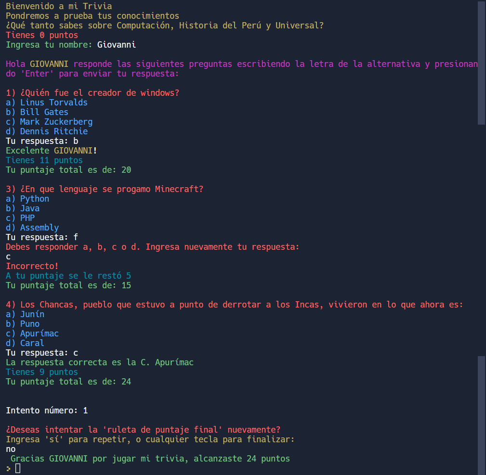

<a name="readme-top"></a>
[![Contributors][contributors-shield]][contributors-url]
[![Forks][forks-shield]][forks-url]
[![Stargazers][stars-shield]][stars-url]
[![Issues][issues-shield]][issues-url]
[![LinkedIn][linkedin-shield]][linkedin-url]

<!-- PROJECT LOGO -->
<br />
<div align="center">
  <a href="https://github.com/giovannirm/Trivia-with-lists-and-cycles">
    
  </a>

  <h3 align="center">README-Trivia</h3>

  <p align="center">
    An awesome README template to jumpstart your projects!
    <br />
    <a href="https://github.com/giovannirm/Trivia-with-lists-and-cycles"><strong>Explore the docs »</strong></a>
    <br />
    <br />
    <a href="https://replit.com/@GiovanniRojas1/Trivia-with-lists-and-cycles?v=1">View Demo</a>
    ·
    <a href="https://github.com/giovannirm/Trivia-with-lists-and-cycles/issues">Report Bug</a>
    ·
    <a href="https://github.com/giovannirm/Trivia-with-lists-and-cycles/pulls">Request Feature</a>
  </p>
</div>

<!-- TABLE OF CONTENTS -->
<details>
  <summary>Table of Contents</summary>
  <ol>
      <a href="#getting-started">Getting Started</a>
      <ul>
        <li><a href="#prerequisites">Prerequisites</a></li>
        <li><a href="#installation">Installation and run the application</a></li>
      </ul>
    </li>
    <li><a href="#usage">Usage</a></li>
    <li><a href="#license">License</a></li>
    <li><a href="#contact">Contact</a></li>
  </ol>
</details>

<!-- GETTING STARTED -->
## Getting Started

This is an example of how you may give instructions on setting up your project locally.
To get a local copy up and running follow these simple example steps.

### Prerequisites

This is an example of how to list things you need to use the software and how to install them.
* Dowload and install python
  ```sh
  https://www.python.org/downloads/windows/
  ```

### Installation

_Below is an example of how you can instruct your audience on installing and setting up your app. This template doesn't rely on any external dependencies or services._

1. Clone the repo
   ```sh
   git clone https://github.com/giovannirm/Trivia-with-lists-and-cycles.git
   ```
2. Run
   ```sh
   python main.py
   ```
<p align="right">(<a href="#readme-top">back to top</a>)</p>

<!-- USAGE EXAMPLES -->
## Usage


<!-- LICENSE -->
## License

Distributed under the Silabuz Academy License. See `LICENSE.txt` for more information.

<p align="right">(<a href="#readme-top">back to top</a>)</p>

<!-- CONTACT -->
## Contact

Giovanni Rojas Morales - [@linkedin](https://www.linkedin.com/in/michelle-giovanni-rojas-morales-909755193/) - giovannirm.python@gmail.com

Project Link: [https://github.com/giovannirm/Trivia-with-lists-and-cycles](https://github.com/giovannirm/Trivia-with-lists-and-cycles)

<p align="right">(<a href="#readme-top">back to top</a>)</p>

<!-- MARKDOWN LINKS & IMAGES -->
<!-- https://www.markdownguide.org/basic-syntax/#reference-style-links -->
[contributors-shield]: https://img.shields.io/github/contributors/othneildrew/Best-README-Template.svg?style=for-the-badge
[contributors-url]: https://github.com/giovannirm/Trivia-with-lists-and-cycles/graphs/contributors
[forks-shield]: https://img.shields.io/github/forks/othneildrew/Best-README-Template.svg?style=for-the-badge
[forks-url]: https://github.com/giovannirm/Trivia-with-lists-and-cycles/network/members
[stars-shield]: https://img.shields.io/github/stars/othneildrew/Best-README-Template.svg?style=for-the-badge
[stars-url]: https://github.com/giovannirm/Trivia-with-lists-and-cycles/stargazers
[issues-shield]: https://img.shields.io/github/issues/othneildrew/Best-README-Template.svg?style=for-the-badge
[issues-url]: https://github.com/giovannirm/Trivia-with-lists-and-cycles/issues
[linkedin-shield]: https://img.shields.io/badge/-LinkedIn-black.svg?style=for-the-badge&logo=linkedin&colorB=555
[linkedin-url]: https://www.linkedin.com/in/michelle-giovanni-rojas-morales-909755193/